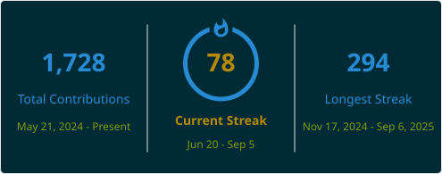

---

## 🚀 About Me

- 🎓 Final-year Computer Science Engineering (B.Tech) student
- 💻 Full Stack Developer — MERN specialist with real client project experience
- 🛠️ Have independently built and deployed production apps for clients, including a complete e-commerce platform
- 🌱 Currently exploring advanced backend & distributed systems
- 🌐 Open source contributor — GirlScript Summer of Code, Hacktoberfest 2024 & 2025

---

## 🌐 Connect with Me

---

## 🛠️ Tech Stack

---

## 🧪 Work in Progress

- **revize-mobile** — React Native mobile version of Revize
- **Revize-CLI-version** — CLI-based MVP of Revize (Inquirer + Chalk), published on NPM
- **StudyFlow** — Zero-distraction study tool with a YouTube Data API integration and manual note-taking

## 📖 Learning & Practice Repos

- **DSA-in-JAVA** — DSA in Java, including Striver's A2Z sheet solutions
- **TS-tutorial** — TypeScript fundamentals
- **python-projects** — Beginner CLI-based Python projects
- **GenAI-with-JS** — Generative AI implementations in JavaScript
- **Java-Language-Practice** — Core Java practice
- **MERN-stack-practice** — MERN fundamentals and practice builds

---

## 📊 GitHub Stats

  
  
  
<!--  -->

---

  🧑‍💻 Thanks for stopping by! Feel free to explore my repos and connect.

  

